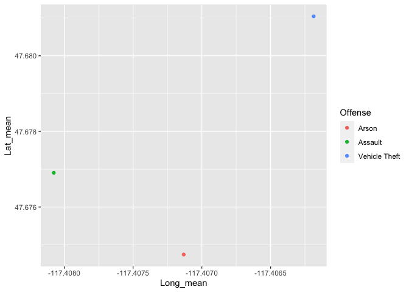
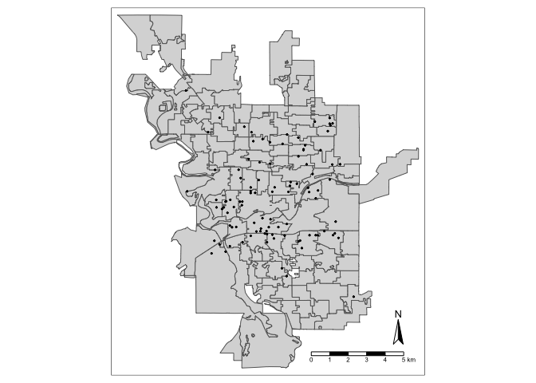
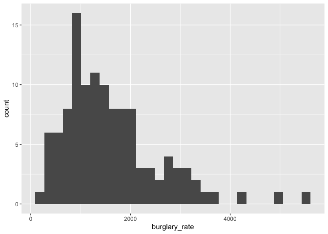
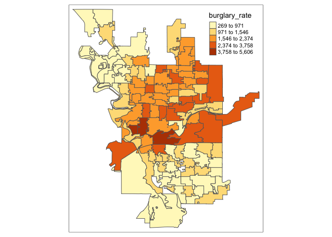

Geog 4/6300: Lab 3
================

## Spatial statistics and visualization

**Overview:** This lab has two main sections: mapping police reports and
calculating crime rates/location quotients. Your answers to the lab
questions should be typed in the relevant spaces below and pushed to
your Github repo.

\###Part 1: mapping the data and its distribution### The data folder has
two files related to crime data for Spokane, Washington.

-   “Spokane_crimes_all” has data for every crime committed in from
    2000-2015.

-   “Spokane_precincts” has precinct boundaries for the city of Spokane
    and its population from 2015. This is saved as a geojson file.

In the first section of this lab, you’ll load this data and analyze it
using several metrics related to point pattern analysis.

**Question 1:** *Load the crime reports (Spokane_crimes_all) file using
read_csv. Then use st_read to import the precinct boundaries. Call the
head of the Spokane_crimes_all file using kable when you are done.*

``` r
spokane_crime<-read.csv("data/Spokane_crimes_all.csv")

spokane_boundaries<-st_read("data/Spokane_precincts.geojson")
```

    ## Reading layer `Spokane_precincts1' from data source 
    ##   `/Users/nick/Downloads/Data science/4300/4300 Lab 2/data/Spokane_precincts.geojson' 
    ##   using driver `GeoJSON'
    ## Simple feature collection with 117 features and 2 fields
    ## Geometry type: MULTIPOLYGON
    ## Dimension:     XY
    ## Bounding box:  xmin: -117.5215 ymin: 47.5871 xmax: -117.3039 ymax: 47.7588
    ## Geodetic CRS:  WGS 84

``` r
kable(head(spokane_crime))
```

| Offense            | Month | Date | Year |      Long |      Lat |
|:-------------------|------:|-----:|-----:|----------:|---------:|
| Vehicle Theft      |     1 |    1 | 2008 | -117.3867 | 47.66856 |
| Theft              |     1 |    1 | 2008 | -117.4382 | 47.65373 |
| Malicious Mischief |     1 |    2 | 2008 | -117.3653 | 47.69429 |
| Burglary           |     1 |    3 | 2008 | -117.3644 | 47.63019 |
| Theft              |     6 |   11 | 2007 | -117.3992 | 47.70969 |
| Drugs              |     1 |    3 | 2008 | -117.4355 | 47.67083 |

**Question 2:** *Filter the data to include just arson, assault, and
vehicle theft. Use group_by and summarise to calculate the mean centers
for each type of offense. Then use ggplot and geom_point to plot these
points on a graph, changing the color based on the offense.*

``` r
arson_assault_vt<-spokane_crime %>%
  filter(Offense=="Arson" | Offense=="Assault" | Offense=="Vehicle Theft") %>%
  group_by(Offense) %>%
  summarise(Long_mean=mean(Long), Lat_mean=mean(Lat))

ggplot(arson_assault_vt,aes(x=Long_mean, y=Lat_mean, color=Offense))+
  geom_point()
```

<!-- -->

**Question 3:** *Interpret how geographic differences between the mean
centers you calculated are meaningful. What do they tell you about the
locations of these crimes relative to one another?*

{These geographic differences between mean centers are meaningful
because they demonstrate the spatial distribution of each type of
offense. The mean geographic centers of each offense, relative to one
another, are relatively distant. This implies that generally speaking,
each offense is committed separate from the other offenses. Given that
the mean centers for “arson” and “assault” are relatively closer to one
another as compared to the more isolated “vehicle theft” offense, it
could be said that instances of arson and assault occur closer to / in
combination with one another, more frequently than that with vehicle
thefts.}

**Question 4:** *Filter the crime reports so that it contains just
murder as the offense type, and then use st_as_sf to convert these to
spatial data. Using tmap, create a map that shows the location of all
reports in the this data frame and the precinct boundaries. Also include
a scale bar and north arrow. See class scripts for a model to work
from.*

``` r
spokane_murder<-spokane_crime %>%
  filter(Offense=="Murder") %>%
  st_as_sf(coords=c("Long","Lat"), crs=4326, remove=FALSE)
  
tm_shape(spokane_boundaries)+
  tm_polygons()+
  tm_shape(spokane_murder)+
  tm_dots()+
  tm_compass()+
  tm_scale_bar()
```

<!-- -->

**Question 5:** *The st_as_sf function has multiple parameters (such as
`coords`). Briefly explain the purpose of each one you used for question
4.*

{“coords” - Identifies coordinate variables in an (x,y) format.
Longitude = x , Latitude = y. “crs” - Identifies projection - 4326 =
WGS84, a standard projection using (x,y) coordinates. “remove” -
specifies to not remove coordinate variables from data frame.}

\###Part 2: Crime rates

In the second section of this lab, you’ll do a spatial join of points to
precincts to identify the precinct ID of each reported crime. You’ll
then summarise these reports to create a crime rate for each precinct,
which is usually reported as crime per 100,000 people.

**Question 6:** *Link the crimes from 2012 to the precinct they were in.
To do this, first filter the points to just 2012 and then match points
to their precinct using a spatial join. Use st_as_sf to convert the
crime reports to spatial data. Then use st_join to link precinct
information to the crime reports. When that’s done, remove the geometry
column using st_set_geometry and then filter out any points that do not
have a matching precinct. Call the head of this table using kable when
you are done.*

``` r
spokane_crime_2012<-spokane_crime %>%
  filter(Year=="2012") %>%
  st_as_sf(coords=c("Long","Lat"), crs=4326, remove=FALSE)

crime_2012_precinct<-spokane_crime_2012 %>%
  st_join(spokane_boundaries %>% st_transform(4326),join=st_within) %>%
  st_set_geometry(NULL) %>%
  filter(is.na(Precinct)==FALSE)
kable(head(crime_2012_precinct))
```

| Offense            | Month | Date | Year |      Long |      Lat | Precinct | totpop |
|:-------------------|------:|-----:|-----:|----------:|---------:|:---------|-------:|
| Malicious Mischief |     1 |    1 | 2012 | -117.4270 | 47.66805 | 3148     |   3969 |
| Burglary           |     1 |    1 | 2012 | -117.4270 | 47.66805 | 3148     |   3969 |
| Vehicle Prowling   |     1 |    1 | 2012 | -117.4071 | 47.69536 | 3119     |   1505 |
| Theft              |     1 |    1 | 2012 | -117.4061 | 47.71259 | 3106     |   1601 |
| Malicious Mischief |     1 |    1 | 2012 | -117.3799 | 47.70602 | 3104     |   2089 |
| Assault            |     1 |    2 | 2012 | -117.4556 | 47.66807 | 3150     |   1374 |

**Question 7:** *Next, make a table of total police reports by offense
type by precinct for this 2012 crime report data. Using group_by and
summarise, grouping by precinct number, population, and offense type.
Spread the data to wide format with the Offense types as column names
and the count of reports as observations. Use kable to show the head of
this table when done.*

``` r
crime_table_2012<-crime_2012_precinct %>%
  group_by(Precinct, totpop, Offense) %>%
  count(Offense, Precinct) %>%
  pivot_wider(names_from = Offense, values_from = n)
kable(head(crime_table_2012))
```

| Precinct | totpop | Assault | Burglary | Drugs | Malicious Mischief | Murder | Theft | Vehicle Prowling | Vehicle Theft | Robbery | Arson |
|:---------|-------:|--------:|---------:|------:|-------------------:|-------:|------:|-----------------:|--------------:|--------:|------:|
| 3100     |   1996 |      31 |       75 |     5 |                 62 |      1 |    44 |               54 |            34 |      NA |    NA |
| 3101     |   1514 |      50 |       46 |     7 |                 43 |      1 |    62 |               24 |            24 |       2 |    NA |
| 3102     |   1814 |      44 |       30 |    11 |                 53 |     NA |    58 |               34 |            41 |       6 |    NA |
| 3103     |   2134 |      44 |       33 |    10 |                 80 |     NA |    72 |               54 |            32 |       3 |    NA |
| 3104     |   2089 |      56 |       38 |     3 |                 79 |     NA |    29 |               60 |            41 |       2 |    NA |
| 3105     |   1611 |      19 |       30 |     5 |                 37 |     NA |    30 |               25 |            23 |       3 |    NA |

**Question 8:** *Select just the precinct number, population, and count
of burglaries from the precincts data frame. Then calculate the
*burglary rate*, dividing the crimes by the population and multiplying
by 100,000. Create a histogram using ggplot showing the distribution of
this new variable.*

``` r
burglary_rate_2012<-crime_table_2012 %>%
  select(Precinct, totpop, Burglary) %>%
  mutate(burglary_rate=Burglary/totpop*100000)

ggplot(burglary_rate_2012,aes(x=burglary_rate))+
  geom_histogram()
```

    ## `stat_bin()` using `bins = 30`. Pick better value with `binwidth`.

<!-- -->

**Question 9:** *Use left_join to join the precinct boundaries and
burglary rate data frame. Then use tmap to create a map of the burglary
rate. Use style=“jenks” in the tm_polygons function to use natural
breaks classification. What’s one geographic trend you see on this map?*

``` r
boundaries_burglary_join<-spokane_boundaries %>%
  left_join(burglary_rate_2012)
```

    ## Joining, by = c("Precinct", "totpop")

``` r
tm_shape(boundaries_burglary_join)+
  tm_polygons("burglary_rate",style="jenks")
```

<!-- -->
{One geographic trend that I see here is that the higher rates of
burglaries tend to be located around the center of Spokane, as well as
the northern parts of the city. Generally speaking, the northern half of
Spokane has higher rates of burglary, and the southern half has lower
rates of burglary.}

**Question 10:** *The burglary rate for the city of Spokane in 2012,
according to this dataset, is 1,657 per 100,000 residents. Using this
figure, calculate the location quotient for burglary in each precinct
within the city. Which precincts have the highest and lowest location
quotients? Interpret what this number tells you for each of these
precincts.*

``` r
boundaries_burglary_join<-boundaries_burglary_join %>%
  mutate(burlary_lq=burglary_rate/1657)
```

{Highest LQ: Precinct 3154 - 3.3833; this means that the burglary rate
in this precinct’s area is over 3 times greater than that of the city as
a whole; far greater rate in comparison.

Lowest LQ: Precinct 6100 - 0.1623; this means that the burglary rate in
this precinct’s area is only about 16% of that of the city as a whole;
far lower rate in comparison.}

**Question 11:** *How do you feel about the work you did on this lab?
Was it easy, moderate, or hard? What were the biggest things you learned
by completing it? How would you rate it low pass/pass/high pass)?*

{I feel that I did a good job on this lab. It was moderately challenging
for me; I got a bit stuck on a few occasions, where I just simply had to
do my best to understand the syntax/vernacular of the various codes
throughout. In doing so, I’ve definitely attained a better grasp of the
coding and functions that I used throughout, which I’m grateful for. The
journey to completing a lab such as this takes me a bit of time due to
trial and error, troubleshooting, and consulting resources for help, but
I successfully answered each question and have a better understanding of
the material as a result. The biggest things I learned were that I
oftentimes overthink the code that I write, and that R is both smarter
and simpler than I give it credit for being. Learning to think in
R-language and to think like a coder is something that I feel I’ve
improved upon as well. I don’t really have the time to dedicate to the
bonus section at this time, but I’d rate this lab as a “high pass” given
that I feel I answered each question successfully.}

## Bonus question! Pick one of the below

Option 1: The st_make_grid function in tmap allows you to create
quadrats of varying sizes. Create a quadrat grid for Spokane using the
precinct polygons that you think is of appropriate scale. See this
walkthrough for how to do so:
<https://vialab.mit.edu/tutorials/module/mapping-in-r-street-trees-in-camberville/>

Following a similar process as you used in steps 6 and 7, count the
burglary reports in each grid cell and map the results using tmap. Then
write a short response that compares the map you made using quadrats to
the one using precincts. Do they show similar spatial patterns? Why or
why not? Which do you prefer?

``` r
#Code goes here
```

{Response goes here}

Option 2: The tm_facets function allows you to make small multiple maps
with tmap. Pick four other listed offenses in the crime report data and
create a dataset that joins the precinct boundaries to the counts of
each offense by precinct. Note: this dataset will need to be in **long**
format, so you will have four rows for each precinct. Then use tm_facets
with tmap to create a single small multiples map showing the geographic
distribution of each offense. Comment on any spatial patterns you see.

Guide to using tm_facets:
<https://cran.r-project.org/web/packages/tmap/vignettes/tmap-getstarted.html#facets>

``` r
#Code goes here
```

{Response goes here}
